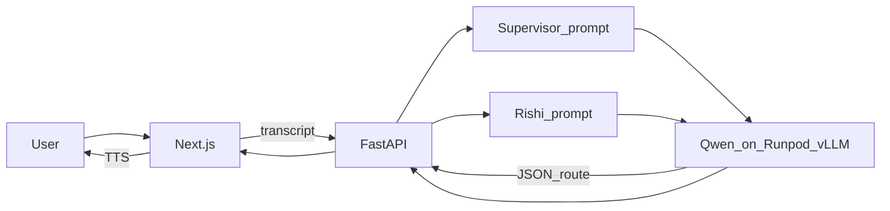

# SAPTARSHI — work so far

Written 14 Sep 2026. This is a log of what we built, decided, and ran — not a product spec.

## Goal

**SAPTARSHI** is a prototype “SLM” specialized in **seven domains**, named after the seven rishis. Plan:

1. Voice-first **web app**
2. Later a basic **mobile app** (same HTTP API)
3. A **supervisor + specialist agents** layout

The seven rishis (placeholders until real domains are assigned): Atri, Bharadvaja, Gautama, Jamadagni, Kashyapa, Vashistha, Vishvamitra.

This phase is **not** training a custom model. It is: prompts + one hosted Instruct model + a supervisor that routes.

## What is in the repo

Empty git repo → monorepo:

| Path | Role |
|------|------|
| `apps/web` | Next.js voice UI (Web Speech STT/TTS, hold-to-talk, type fallback) |
| `apps/api` | FastAPI: `POST /v1/chat`, health, model ping |
| `apps/stub-llm` | Fake OpenAI `/v1/chat/completions` so UI works without a GPU |
| `packages/agents` | Supervisor + seven rishi prompts + LLM client |
| `infra/model` | Notes for vLLM / Hugging Face GPU hosting |
| `docker-compose.yml` | stub-llm + api + web |

HTTP contract (unchanged for a future mobile app):

```http
POST /v1/chat
{ "text": "..." }

→ { "reply", "spoken", "agents_used", "agents_display", "route_reason", "primary" }
```

The **browser never talks to the GPU**. It talks to FastAPI. FastAPI talks to the model.

## How the supervisor routes (v1)

There is **one** model. “Supervisor” and “Gautama” are **different system prompts**, not seven checkpoints.

On each question FastAPI:

1. Calls the model with `prompts/supervisor.md` → expects JSON `{ primary, secondary, reason }`.
2. Calls the model again with that rishi’s prompt (e.g. `prompts/bharadvaja.md`).
3. Optionally a second rishi + a short spoken summary.

If JSON parse fails, it defaults to **Atri**.

This is **prompt routing**. Later options we discussed, not built:

- A **tiny classifier** on CPU for the 7-way label (cheaper, one GPU generate per turn).
- **LoRA/QLoRA adapter** on your dataset (small extra weights on top of Instruct), trained on a **different** GPU job (Colab or a second Runpod), then loaded at serve time.

## Model choice

- Checkpoint: **`Qwen/Qwen2.5-7B-Instruct`**
- Trained by **Alibaba Cloud’s Qwen team**; Hugging Face only **hosts** the files.
- **Instruct**, not the base `Qwen/Qwen2.5-7B` (base is not a chat/JSON router).
- Fine-tune later is allowed (LoRA on this Instruct checkpoint).

## Local vs GPU

- **Stub:** keyword routing, placeholder answers. `MODEL_BASE_URL=http://127.0.0.1:8001/v1`
- **Runpod vLLM:** real Qwen. Same FastAPI client; only the URL changes.

## Runpod setup (account)

1. Signed up; added **~$10** credits (required — the agent uses **your** account; $0 credits cannot create a pod).
2. Installed Runpod **skills** (`~/.agents/skills/`) and **MCP** (`~/.cursor/mcp.json` → `https://mcp.getrunpod.io/`), then **Sign in with Runpod**.
3. `list-pods` was empty before Day 1 (expected).

India (`AP-IN-1`) had **no RTX 4090**. Only **H100 ~$3.49/hr**. You chose **option B**: 4090 **outside India**.

## Day 1 (done) — prove E2E

**Plan:** create pod → vLLM downloads Qwen from Hugging Face onto the pod disk → point FastAPI at it → test UI → (you chose to **leave the pod running** after a break, not delete at EOD).

**Created pod** (terminated 14 Sep 2026 ~13:36 UTC after E2E)

| Field | Value |
|-------|--------|
| Name | `saptarshi-vllm` |
| ID | `yk2wau2ntq4nxe` |
| GPU | Secure **RTX 4090**, **EU-RO-1** |
| Price | **$0.74/hour** GPU time (not per token) |
| Image | `vllm/vllm-openai:latest` |
| Args | `--model Qwen/Qwen2.5-7B-Instruct --host 0.0.0.0 --port 8000 --max-model-len 4096 --gpu-memory-utilization 0.90` |
| Disk | 60 GB ephemeral (model lives here; **gone if you terminate**) |

**Public model URL (no API key):**  
`https://yk2wau2ntq4nxe-8000.proxy.runpod.net/v1`

That proxy is **public**. Do not put secrets in prompts if you care. Optional later: `--api-key` on vLLM.

Local `.env` was set to that `MODEL_BASE_URL` and `MODEL_NAME=Qwen/Qwen2.5-7B-Instruct`.

**Verified**

- Direct: `GET /v1/models` and a `pong` chat completion on the pod.
- FastAPI: fever question → **Bharadvaja** → real Qwen answer.
- You confirmed the **web UI** works.

`prompts/supervisor.md` went missing once during the session and was restored; without it `/v1/chat` 500s.

## Billing (what you pay)

On this **self-hosted pod** you pay **GPU clock time** (~$0.74/hr while the pod exists), plus small **storage** / possible **egress**. Hugging Face did **not** charge per token for the download. Tokens would only bill on a **pay-per-token API** (Together, OpenAI, HF Inference, etc.).

~$10 ≈ **~13 hours** of this 4090 if left on continuously.

## What we decided not to do (yet)

- Host **web + API on the same GPU pod** — technically possible, wasteful. Keep GPU = model; put Next/FastAPI on cheap CPU (Fly, Render, Railway, VPS) or localhost for demos.
- **Network volume** to persist Qwen weights across pod deletes (recommended before Day 3 so you do not re-download ~15 GB).
- Fine-tune GPU job (kit is ready under `training/`; run when you have a dataset).
- Native mobile app.
- Auth, RAG, real domain names for each rishi.

## Your next-day plan (agreed)

1. **Day 1** — E2E with stock Instruct (done). Delete when you want to stop GPU spend.
2. **Day 2** — Kit in [`training/`](../training/README.md): put JSONL in `training/data/`, then a **PyTorch** 4090 (not vLLM). Save adapter, delete that pod. **Not started** (waiting on your dataset).
3. **Day 3** — vLLM again: Instruct **+ adapter**. Prefer a volume so base weights are not re-pulled.

## How to run again

Stub (no GPU): see root [README.md](../README.md).

Against the live pod: FastAPI with `MODEL_BASE_URL` as above; web `npm run dev` in `apps/web`. GPU must still be **Running**.

To **stop charges:** terminate pod `yk2wau2ntq4nxe` (say “delete the pod” in chat, or delete in [Runpod console](https://console.runpod.io)). **Stop** keeps a volume/disk that can still cost a little; **terminate** removes the machine.

## Architecture (v1)


